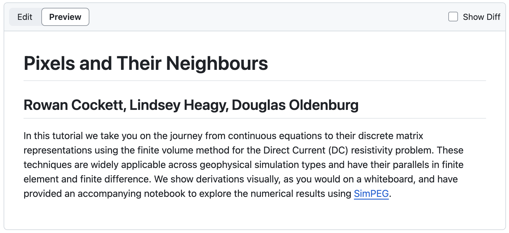

# readme-md MyST Template

This template creates a very basic `README.md` file with title, author names, and abstract.

In the future, there is tons of room to expand. It might be nice to add options for badges and maybe the ability to bring in other content besides abstract.